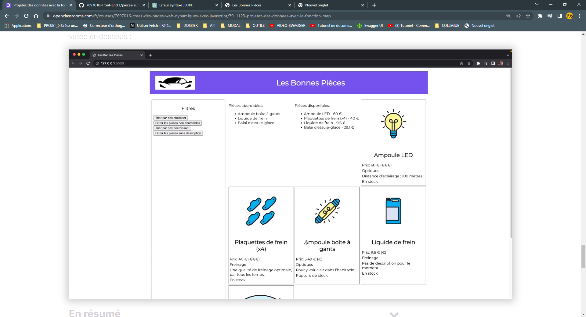

## Projetez des données avec la fonction map /LAMBDA

 map/lambda Créer une liste qui ne contient que le nom des pieces

```js
const noms = pieces.map(piece => piece.nom) 
Cela donne la liste suivante :
[
    "Ampoule LED",
    "Plaquettes de frein (x4)",
    "Ampoule boîte à gants",
    "Liquide de frein",
    "Balai d'essuie-glace"
]
```

### Ajoutez et supprimez les éléments d’une liste

 Pour supprimer des éléments dans une liste on doit parcourir la liste de la fin vers le début

Avec `splice` **`elle prend en argument deux valeur  l'indice à partir du quel supprimer  des éléments`**

`La quantité déléments à supprimer`

```js
const noms = pieces.map(piece => piece.nom)
 for(let i = pieces.length -1; i >= 0; i--){
 if( pieces[i].prix > 35){
 noms.splice(i,1)
 }
 }
 console.table(noms);


```

//resultat:


### Affichez la liste des pièces abordables


PENSE BETE********************************************************************************************

LAMBDA /MAP:  la syntaxe  pour écrire des fonctions simpifiées

MAP : pour transformer une information ->l' objet d'une piece auto veers le nom de la pieces

```js
const noms = pieces.map(piece => piece.nom) 
```

SPICE : supprimez des éléments  dans une liste 

```js
const noms = pieces.map(piece => piece.nom);
for(let i = pieces.length -1 ; i >= 0; i--){
   if(pieces[i].prix > 35){
       noms.splice(i,1)
   }
}
console.log(noms)
```


Résultat :



code:

```html
body>
	<header>
		
		<h1>Les Bonnes Pièces</h1>
	</header>
	<main>
		<!-- Menu de recherche -->
		<section class="filtres">
			<h3>Filtres</h3>
			<button class="btn-trier">Trier par prix croissant</button>
			<br>
			<button class="btn-filtrer">Filtrer les pièces non abordables</button>
			<br>
			<button class="btn-decroissant">Prix décroissants</button>
			<br>
			<button class="btn-nodesc">Fiche description</button>
		</section>
		<!-- Fiches produits -->
		<section class="fiches">
			<div class="abordables">
				<h3>Pieces abordables:</h3>
			</div>

			<div class="disponibles">
				<h3>Pieces disponibles:</h3>
			</div>

		</section>
	</main>


</body>
```


```js

// P2C2
// Description des pieces disponible et le prix des pieces
const nomsDisponibles = pieces.map(piece => piece.nom);
const prixDisponibles = pieces.map(piece => piece.prix);

for (let i = pieces.length -1; i >= 0; i--) {
  if (pieces[i].disponibilite === false) {
    nomsDisponibles.splice(i,1);
    prixDisponibles.splice(i,1);
  }
}
// console.table(nomsDisponibles);
// Parcourir la liste du début a la fin.
const disponiblesElement = document.createElement("ul");

for (let i=0; i < nomsDisponibles.length; i++) {
const nomElement = document.createElement("li");
nomElement.innerText =`${nomsDisponibles[i]}-${prixDisponibles[i]} €`;
// Rattacher l'élément li a sont parent
disponiblesElement.appendChild(nomElement);
}
// Rattacher l'élément 
// document.querySelector(".disponibles").appendChild(disponiblesElement);
document.querySelector(".disponibles").appendChild(disponiblesElement);

```
