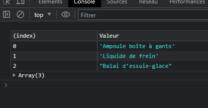
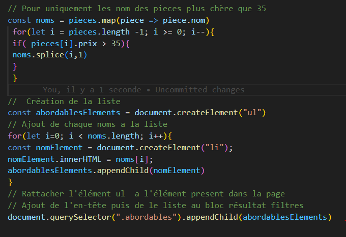

## Projetez des données avec la fonction map /LAMBDA

 map/lambda Créer une liste qui ne contient que le nom des pieces

```js
const noms = pieces.map(piece => piece.nom) 
Cela donne la liste suivante :
[
    "Ampoule LED",
    "Plaquettes de frein (x4)",
    "Ampoule boîte à gants",
    "Liquide de frein",
    "Balai d'essuie-glace"
]
```

### Ajoutez et supprimez les éléments d’une liste

 Pour supprimer des éléments dans une liste on doit parcourir la liste de la fin vers le début

Avec `splice` **`elle prend en argument deux valeur  l'indice à partir du quel supprimer  des éléments`**

`La quantité déléments à supprimer`

```js
const noms = pieces.map(piece => piece.nom)
 for(let i = pieces.length -1; i >= 0; i--){
 if( pieces[i].prix > 35){
 noms.splice(i,1)
 }
 }
 console.table(noms);


```

//resultat:



### Affichez la liste des pièces abordables


